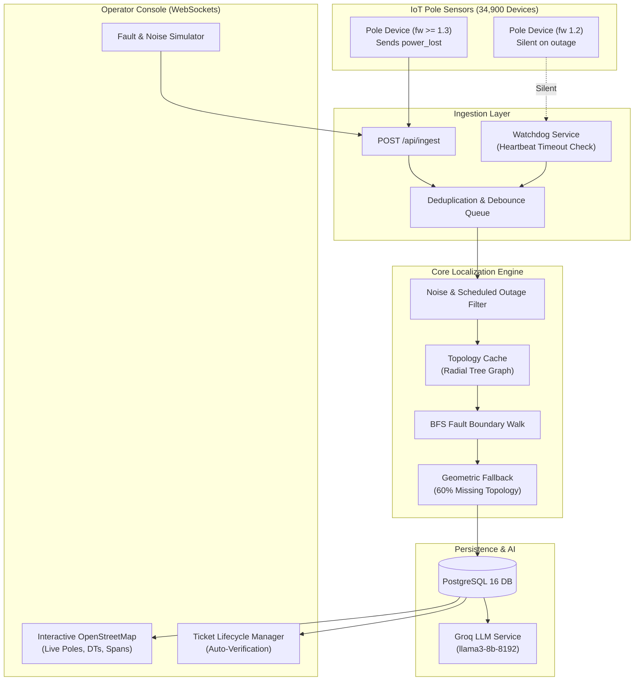

# Architecture Documentation — KSPDB Fault Management System

## 1. System Overview & Architecture Diagram

The KSPDB Fault Management System is designed to ingest telemetry from 34,900+ IoT pole sensors across the Karnataka State Power Distribution Board network, detect power outages, localize exact line span/DT/feeder faults, manage ticket lifecycles, and auto-verify restoration.



---

## 2. Ingestion & Data Pipeline

- **Protocol**: HTTP POST (`/api/ingest`) accepting telemetry JSON payloads.
- **Deduplication & Ordering**:
  - `seq` number is tracked per `device_id`. Duplicated packets (common in NB-IoT retries up to 6 hours) are discarded if `seq` <= last processed `seq` (unless `boot` event resets sequence).
- **Clock Skew Handling**:
  - Device timestamps (`ts`) have up to ±90s jitter. Ingestion stamps arrival time alongside `ts` and sorts telemetry windows by server arrival time while recording device clock offset.
- **Silent Firmware 1.2 Devices**:
  - ~8% of devices use firmware 1.2 which never sends `power_lost`. A background watchdog (`heartbeatWatchdog.js`) periodically flags devices that miss heartbeats beyond 20 minutes as dark (`energized = false`), seamlessly feeding them into the localization trigger.
- **Burst Capacity**:
  - Ingest endpoints accept raw telemetry, write to memory queues, and debounce alerts over a configurable window (`DEBOUNCE_MS = 20,000ms`) to group thousands of simultaneous pole reports during major outages.

---

## 3. Data Model & Network Topology

### PostgreSQL Schema Overview
- **`substations`**: Substation metadata & feeder links.
- **`feeders`**: 11 kV Feeder metadata.
- **`transformers`**: Distribution Transformers (`dt_id`, `lat`, `lon`, `capacity_kva`, `households_served`).
- **`poles`**: `pole_id`, `lat`, `lon`, `dt_id`, `feeder_id`, `parent_pole_id`, `seq_on_line`, `energized`, `last_seen`, `device_id`.
- **`tickets`**: `id`, `fault_type` (`span`, `dt`, `feeder`), `target_id`, `coordinates`, `pincode`, `affected_poles`, `estimated_households`, `confidence`, `confidence_reason`, `status`, `auto_verified`, `ai_summary`.

### Topology Graph Cache
- In-memory adjacency graph stored as a parent-child tree per Distribution Transformer (`dt_id`).
- Radial hierarchy ensures zero cyclic dependencies (`substation -> feeder -> transformer -> pole -> child poles`).

---

## 4. Fault Localization Algorithm

The core localization engine converts **node telemetry** (live/dark poles) into **edge state** (failed span / transformer / feeder):

```
       DT ── P-1 (Live) ── P-2 (Live) ── ╳ (FAULT) ── P-3 (Dark) ── P-4 (Dark)
```

### Algorithm Steps:
1. **Symptom Grouping**: When poles turn dark, group them by `dt_id` and `feeder_id`.
2. **Boundary Walking (BFS)**:
   - For 40% of DTs with known `parent_pole_id`: Perform Breadth-First Search from the DT downwards.
   - Find the frontier where `parent` is **Live** and `child` is **Dark**. The span between `parent` and `child` is identified as the fault location (`span_fault`).
   - If ALL poles under a DT are dark and no parent pole is live: Flag as `dt_fault`.
   - If ALL DTs under a feeder are dark: Flag as `feeder_fault`.
3. **Handling 60% Missing Topology**:
   - For DTs where `parent_pole_id` / `seq_on_line` are missing:
     - Estimate topology geometrically using Euclidean / Haversine distance from the DT coordinate.
     - Build a Minimum Spanning Tree (MST) or nearest-neighbor radial path.
     - Set ticket confidence to `MEDIUM` or `LOW` with explicit reason: *"Missing explicit topology; location estimated via spatial proximity graph."*
4. **Single Isolated Dark Pole (Sensor Fault)**:
   - If pole P-3 is dark, but its child P-4 is LIVE: Physically impossible as a line fault. Flagged as **Sensor / Lamp Fault**, ticket suppressed to prevent false dispatch.

---

## 5. Noise & False Positive Prevention ("Don't Cry Wolf")

- **Scheduled Load Shedding**: Integrated with `/api/topology/scheduled-outages`. If a feeder or DT is undergoing planned maintenance, telemetry power loss events under that scope are suppressed from triggering fault tickets.
- **Dead Modems**: A dead modem on an isolated pole without downstream dark poles is categorized as `sensor_fault` or modem failure rather than a grid outage.
- **Telemetry Debouncing**: 20-second aggregation buffer ensures transient voltage sags or out-of-order packet arrivals do not create duplicate tickets.

---

## 6. API Surface

| Endpoint | Method | Description |
|----------|--------|-------------|
| `/api/health` | `GET` | Health check & DB connection status |
| `/api/ingest` | `POST` | Ingest pole device telemetry payload |
| `/api/tickets` | `GET` | Retrieve list of all fault tickets |
| `/api/tickets/:id` | `GET` | Retrieve detailed fault ticket & affected pole list |
| `/api/tickets/:id` | `PATCH` | Update ticket status (`acknowledged`, `crew_assigned`, `resolved`, `closed`) |
| `/api/topology` | `GET` | Retrieve full network graph, poles, and transformers for map rendering |
| `/api/simulator/inject-fault` | `POST` | Inject synthetic fault (`span`, `dt`, `feeder`, `isolated`) |
| `/api/simulator/inject-repair` | `POST` | Inject restoration telemetry for a specific ticket |
| `/api/simulator/reset` | `POST` | Reset all poles back to live state |

---

## 7. Operator UI & UX Design

- **Map First**: Dark mode OpenStreetMap visualization using Leaflet. Color-coded markers (Green = Live, Red Pulsing = Dark, Amber = Fault Pin, Purple = DT).
- **Incident Hierarchy**: Top bar displays high-level metrics (Live Poles, Dark Poles, Open Tickets, Total Poles). Sidebar prioritizes high-impact faults (Feeder/DT > Span) and lists estimated affected households.
- **Telemetry-Driven Auto-Verification**: Linemen cannot manually mark tickets as `verified`. When telemetry arrives showing 100% of affected poles energized, the system automatically transitions the ticket to `verified` state and alerts the operator via WebSockets.

---

## 8. AI Feature (Groq LLM Integration)

- **Model**: `llama3-8b-8192` via Groq Cloud API.
- **Purpose**: Generates concise, natural-language executive briefings for control room operators at 2 a.m.
- **Example Summary**: *"Span fault detected between P-024431 and P-024432 under DT D-0112 (Ward W-084). 14 poles offline affecting ~318 households. Recommended crew: 2 linemen + 9m PCC wire."*
- **Fallback**: If Groq API key is missing or encounters a timeout, system seamlessly degrades to deterministic template summaries.
